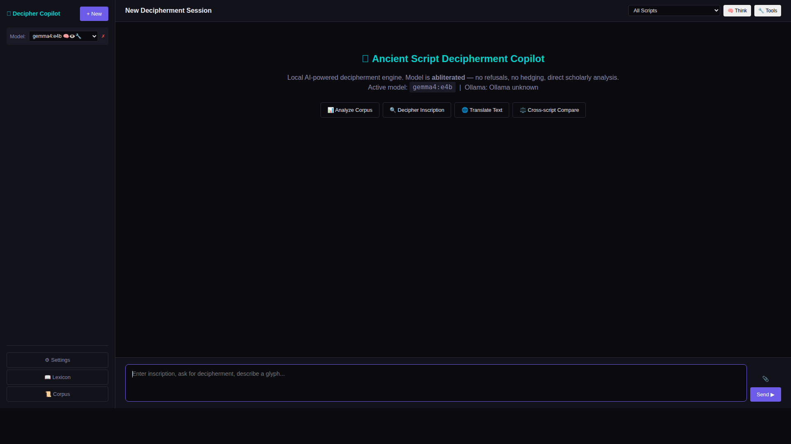
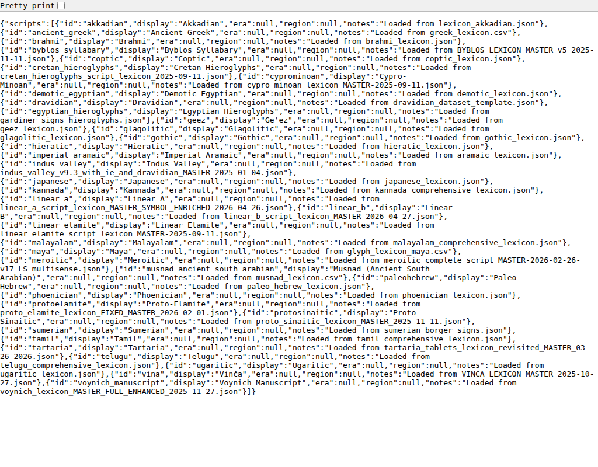
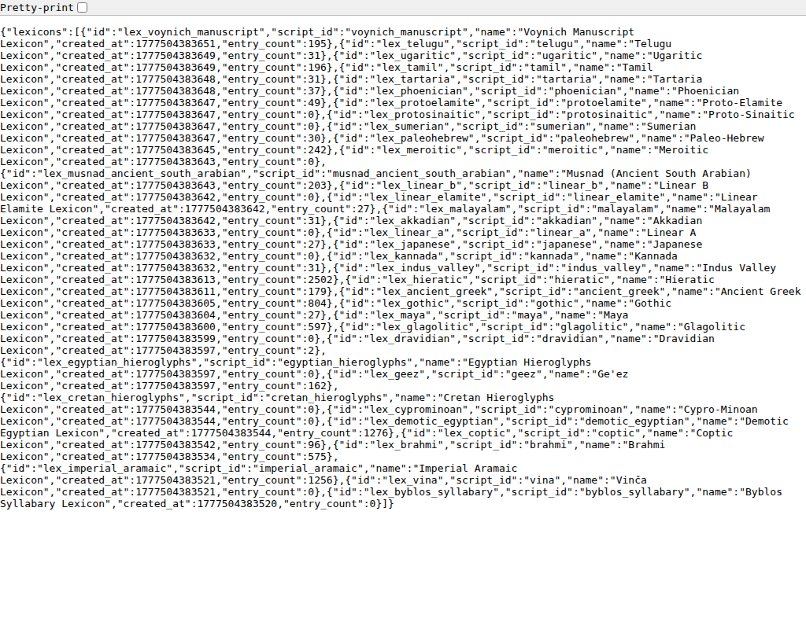
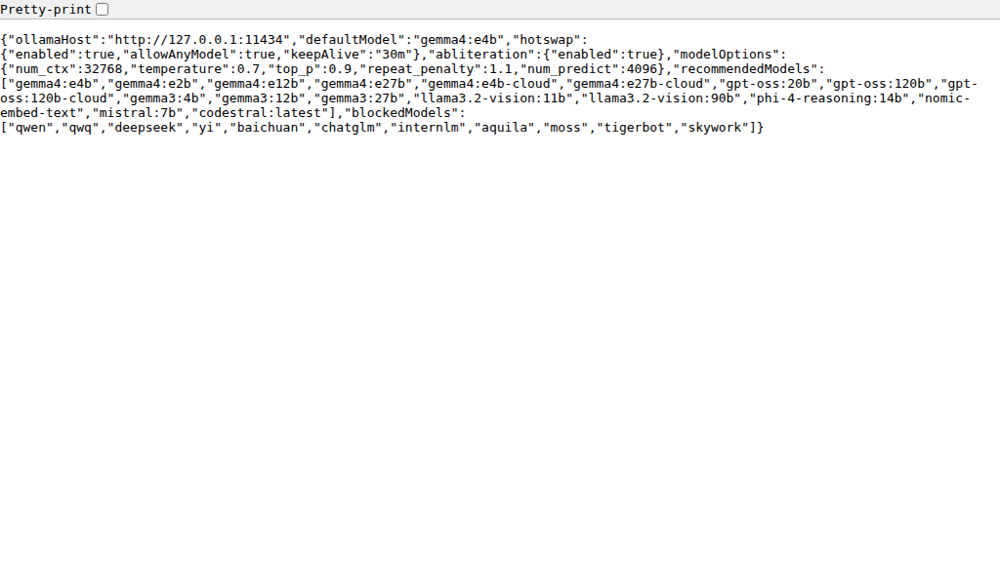

# User Guide

## Quick Start

### 1. Prerequisites

| Requirement | Version | Notes |
|-------------|---------|-------|
| Node.js | 22.13 LTS | Required for server |
| Ollama | ≥ 0.16 | Local AI inference |
| RAM | 8 GB+ | 16 GB for large models |
| Disk | 10 GB+ | For models + datasets |

### 2. Installation

```bash
cd decipher-copilot/server
npm install
```

### 3. Start Ollama

```bash
# Terminal 1
ollama serve

# Pull recommended models
ollama pull gemma4:e4b          # Default (vision + tools + thinking)
ollama pull nomic-embed-text    # For semantic search
```

### 4. Start the Server

```bash
# Terminal 2
cd decipher-copilot/server
node src/index.js
```

On first run, an auth token is generated and printed to console. Save it.

### 5. Open the UI

Navigate to **http://127.0.0.1:7340** in any Chromium-based browser.

---

## Interface Overview



### Sidebar (Left)
- **Model Picker** — Switch between available Ollama models instantly
- **Session List** — All your decipherment sessions, click to resume
- **+ New** — Start a fresh session
- **Settings** — Configure Ollama host, model parameters, abliteration
- **Lexicon** — Browse all loaded sign vocabularies
- **Corpus** — Explore loaded inscription corpora

### Main Area (Center)
- **Chat Messages** — Streaming conversation with the AI
- **Thinking Panel** — Expandable chain-of-thought reasoning
- **Input Area** — Type messages, attach images/PDFs

### Controls (Header)
- **Script Select** — Filter to a specific writing system
- **🧠 Think** — Toggle chain-of-thought display
- **🔧 Tools** — Toggle LLM tool use (lexicon/corpus lookup)

---

## Working with Scripts

The system ships with **75 ancient and modern scripts** pre-loaded:

| Category | Scripts |
|----------|---------|
| Undeciphered | Linear A, Indus Valley, Proto-Elamite, Phaistos Disc, Cypro-Minoan, Cretan Hieroglyphs, Voynich Manuscript, Byblos Syllabary, Vinča, Tartaria |
| Deciphered | Linear B, Egyptian Hieroglyphs, Hieratic, Demotic, Akkadian, Sumerian, Ugaritic, Phoenician, Paleo-Hebrew, Aramaic, Meroitic, Proto-Sinaitic |
| Classical | Latin (215k+ entries), Ancient Greek, Sanskrit, Old Persian, Hittite, Tocharian, Avestan |
| Semitic/Near East | Arabic, Hebrew, Syriac, Nabataean, Elamite, Luwian Hieroglyphs, Middle Persian, Sogdian |
| Asian | Brahmi, Tamil, Telugu, Kannada, Malayalam, Japanese, Chinese Classical, Korean, Thai, Tibetan, Burmese, Khmer, Javanese Kawi |
| European | Glagolitic, Gothic, Old Norse Runic, Old English, Armenian, Georgian, Etruscan |
| African | Ge'ez, Coptic, Amharic, Maya |



---

## Chat Features

### Basic Decipherment

Type an inscription or describe a glyph:

```
Decipher this Linear A inscription: A-SA-SA-RA-ME
```

The AI will:
1. Look up signs in the lexicon (via tools)
2. Check corpus frequency data
3. Apply linguistic analysis
4. Provide a reading with confidence levels

### Image Analysis

Click **📎** to attach an inscription photo. Vision-capable models (gemma4, llama3.2-vision) will:
- Identify visible glyphs
- Transcribe the sign sequence
- Provide a decipherment attempt

### Chain-of-Thought

Enable **🧠 Think** to see the model's internal reasoning. This shows:
- Which signs it's considering
- Cross-references to known forms
- Statistical reasoning about frequencies

### Tool Use

With **🔧 Tools** enabled, the model can automatically:
- `lexicon_lookup` — Search sign vocabularies
- `corpus_search` — Find parallel inscriptions
- `frequency_report` — Analyze sign distributions
- `entropy_report` — Compute linguistic metrics
- `zipf_report` — Check Zipf law compliance
- `cross_inscription_check` — Validate hypotheses across corpus
- `add_lexicon_entry` — Propose new readings

---

## Lexicon Browser

Click **📖 Lexicon** in the sidebar to browse loaded vocabularies.



Each lexicon contains:
- **Token** — The sign ID sequence
- **Gloss** — Proposed reading/translation
- **Confidence** — Scholar confidence (0.0–1.0)
- **Source** — Academic reference

---

## Analysis Tools

### Frequency Analysis

Compute unigram/bigram/trigram frequencies for any corpus:

```
POST /api/analysis/frequency
{ "corpus_id": "...", "n": 2, "positional": true }
```

### Zipf Law Fit

Test whether a script follows Zipf's law (indicative of natural language):

```
POST /api/analysis/zipf
{ "corpus_id": "..." }
```

### Entropy Metrics

Available metrics:
- **Shannon H1** — First-order entropy
- **Conditional H2** — Next-sign predictability
- **Block entropy** — Multi-sign patterns
- **Rényi entropy** — Collision entropy
- **Yule's K** — Vocabulary richness

### Batch Analysis

Run all metrics across multiple corpora in one request:

```
POST /api/analysis/batch
{ "corpus_ids": [...], "analyses": ["zipf", "shannon", "frequency"] }
```

---

## Semantic Search

Build an embedding index for similarity search:

```
POST /api/search/index
{ "corpus_id": "...", "model": "nomic-embed-text" }
```

Then search by meaning:

```
POST /api/search/semantic
{ "query": "fish offering to deity", "top_k": 10 }
```

---

## Model Management

### Hotswap

Switch models anytime from the sidebar dropdown or via API. No restart needed.

### Custom Models

Create decipherment-specialized models from built-in presets:

```
POST /api/models/create
{ "name": "my-decipher", "preset": "decipherment-general" }
```

Available presets:
- `decipherment-general` — Aggressive decipherment
- `glyph-ocr` — Vision sign identification
- `statistical-analyst` — Metric interpretation
- `translation-engine` — Translation attempts
- `reasoning-deep` — Long reasoning chains

---

## Export

Generate publication-ready reports:

```
POST /api/export/report
{ "corpus_id": "...", "format": "latex", "title": "My Analysis" }
```

Supported formats:
- **Markdown** — For documentation, GitHub
- **LaTeX** — For academic papers

---

## Settings



Configurable via UI or environment variables:

| Setting | Env Var | Default |
|---------|---------|---------|
| Host | `DECIPHER_HOST` | 127.0.0.1 |
| Port | `DECIPHER_PORT` | 7340 |
| Ollama Host | `OLLAMA_HOST` | http://127.0.0.1:11434 |
| Default Model | `DECIPHER_MODEL` | gemma4:e4b |
| DB Passphrase | `DECIPHER_DB_PASSPHRASE` | (auto-generated) |
| Log Level | `DECIPHER_LOG_LEVEL` | info |

---

## Troubleshooting

| Problem | Solution |
|---------|----------|
| "Ollama not reachable" | Run `ollama serve` in another terminal |
| Model not responding | Check `ollama list` — pull the model first |
| Slow responses | Use smaller model (gemma4:e2b) or reduce `num_ctx` |
| DB errors | Delete `data/databases/` and restart (fresh DB) |
| Port in use | Set `DECIPHER_PORT=7341` env var |
| High memory | Reduce `num_ctx` in settings, use quantized models |
